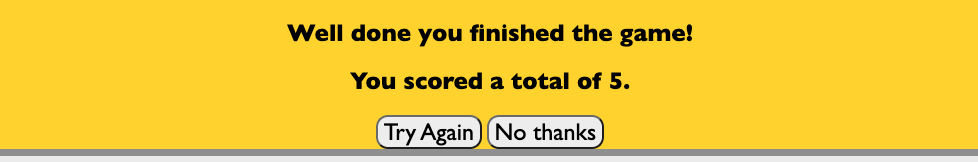
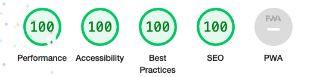

# Welcome to the Super Sports Quiz

This project is inspired by my passion for sport. So I made a quiz containing some pretty straightforward questions. The quiz is accessible to anyone!

You can find the live version of the site here [here](https://drennan98.github.io/Super-Sports-Quiz).

I went with a sports quiz idea as I'm passionate about sport and thought it would be easy to develop.

Main technologies used were **HTML, CSS and JavaScript**.

# Features

- "Super Sports Quiz" is a clickable link which can be reused to start the game at ease.

.

- Press "Start Game" to start the game and text your basic sport knowledge.
  

- The project consists of 5 relatively easy sports questions. At the end, the user will have the option to "Try Again" or click "No Thanks"
  which will then display the message "Thanks for playing".

#  Wireframes

- Desktop
  

- Tablet

- Smartphone

# Design

##  Color Palette

The following colors were taken from [Coolors](https://coolors.co/).

- #DDD1C7, #3ec300, #C455A8 were some of the colors used.

##  Fonts

The fonts used were Gill Sans, Gill Sans MT, Calibri, Trebuchet MS", sans-serif.

## Layout 

- The application features a very simple layout. The heading, "Super Sports Quiz", followed by a very brief introduction of the quiz and finally the 
start game button.

#  Testing

- One of the first thing I did was send into the Peer Code Review on Slack for testing and feedback.

- I confirmed that this website works on different browsers like Safari and Google Chrome.

- I sent the quiz to some friends to test out the functionality of the quiz and it got a positive response. 

#  Validations

- HTML =

- CSS =

- JavaScript =

# Lighthouse Testing

- Phone = 

- Desktop = 

# Deployment

- Throughout the project, I committed changes using these steps: "git add ." --> "git commit -m "message"" --> "git push".

The site was deployed to GitHub pages. **The steps I took to achieve this were:**

Go to the settings in the GitHub repository.

Navigate your way to the pages section which should be the last tab on the left under Code and Automation.

Make sure the source is Deploy from a branch.

Set the branch to "main" and click save.

#  Credits

- My mentor Spencer for his patience and guidance.
