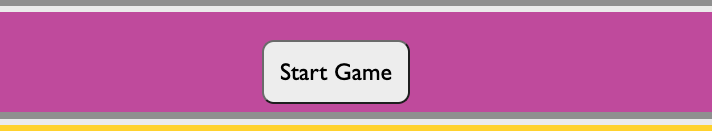

# Welcome to the Super Sports Quiz

This project is inspired by my passion for sport. So I made a quiz containing some pretty straightforward questions. The quiz is accessible to anyone!

You can find the live version of the site here [here](https://drennan98.github.io/Super-Sports-Quiz).

I went with a sports quiz idea as I'm passionate about sport and thought it would be easy to develop.

Main technologies used were **HTML, CSS and JavaScript**.

# Key Project Goals 

- I wanted to make an interactive front-end application and incorporate the JavaScript material I have learned.

- I wanted to give the user feedback on their score and I wanted the user to be able to keep track of there score as the game went on.

- I wanted to use colors, fonts and a structure which were easy on the eye.

- I wanted the application to be easy to navigate and user friendly.
  
- I put relatively easy questions in the quiz so everyone has a chance to pass. I put in a small amount of questions to keep the user interested. 

# Features

- "Super Sports Quiz" is a clickable link which can be reused to start the game at ease.

- Press "Start Game" to start the game and test your basic sport knowledge.
  

- The project consists of 5 relatively easy sports questions. The user will have the option to "Try Again" or click "No Thanks" when all questions are answered.
  Pressing "Try Again" will restart the game while pressing "No Thanks" will display "Thanks for playing message" and end the game. There is also a score counter and then the user will get some feedback on how they scored at the end.

#  Wireframes

##   Desktop
  

### Tablet

#### Smartphone

# Design

##  Planning

- The plan was always to keep the application as simple as possible while using simple colors and a basic structure. I'm still pretty new
  to coding so I'm trying to keep it as basic as possible while trying my best to meet the criteria.

##  Color Palette

The following colors were taken from [Coolors](https://coolors.co/).

- #DDD1C7, #3ec300, #C455A8 were some of the colors used.

##  Fonts

The fonts used were Gill Sans, Gill Sans MT, Calibri, Trebuchet MS", sans-serif.

## Layout

- The application features a very simple layout. The heading, "Super Sports Quiz", followed by the instructions of the quiz on the landing page. The user
  then has the option to press the "Start Game" button. 

#  Testing

- One of the first thing I did was send into the Peer Code Review on Slack for testing and feedback.

- I confirmed that this website works on different browsers like Safari and Google Chrome.

- I sent the quiz to some friends to test out the functionality of the quiz and it got a positive response.

#  Validations

[HTML Validation Results]()

[CSS Validation results](https://jigsaw.w3.org/css-validator/validator?uri=https%3A%2F%2Fdrennan98.github.io%2FSuper-Sports-Quiz%2F&profile=css3svg&usermedium=all&warning=1&vextwarning=&lang=en)

- JavaScript =

# Lighthouse Testing

##  Phone

## Desktop

# Deployment

- Throughout the project, I committed changes using these steps: "git add ." --> "git commit -m "message"" --> "git push".

The site was deployed to GitHub pages. **The steps I took to achieve this were:**

Go to the settings in the GitHub repository.

Navigate your way to the pages section which should be the last tab on the left under Code and Automation.

Make sure the source is Deploy from a branch.

Set the branch to "main" and click save.

You can find the live version of the site here [here](https://drennan98.github.io/Super-Sports-Quiz).

# Bugs

- I encountered no major bugs throughout deployment.

#  Credits

- My mentor Spencer for his patience and guidance.

- I used my PP1 as a reference for my READme structure, but have added some different headings throughout the development process.

- I used various YouTube tutorials on JavaScript as it was a language I was struggling with, I will provide links for these tutorials.

[First Tutorial](https://www.youtube.com/watch?v=rCVqQ8NKU2M&t=120s)

[Second Tutorial](https://www.youtube.com/watch?v=PBcqGxrr9g8&t=386s)

[Third Tutorial](https://www.youtube.com/watch?v=LQGTb112N_c)

[Fourth Tutorial](https://www.youtube.com/watch?v=FOD408a0EzU) (It took me a while to get the hang of functions.)

- Another external resource I used was [Geeks for Geeks](https://www.geeksforgeeks.org/how-to-create-a-simple-javascript-quiz/.).
